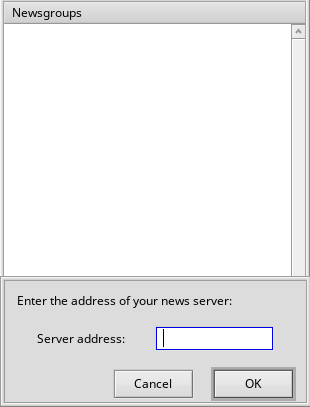

Item
==============================

Item is a newsreader for BeOS. It is more or less modelled after MT-Newswatcher on the Mac--in
fact you can even open your MT-Newswatcher newsgroup files with it. It has two advantages
over MT-Newswatcher: it is a bit more multithreaded and "live", and it caches headers.
These two features together mean that when you open up a newsgroup, you don't have to wait before
you can start reading articles in the group.

However, Item still has a few rough edges and missing features. I'm sure you'll
discover these for yourself as you use it.

### Tips
Item deals with most of the newsreading process, but it doesn't actually show you the articles itself,
nor allow you to compose articles. Instead, it lets you choose whatever editor you like for
viewing/editing news articles. Most editors don't have any special facility for this,
so I strongly recommend using The English Editor II, which does. EE2 is not complete yet,
but it provides what you might call "a unique newsreading experience".

So, first download Item and The English Editor II. Then, you'll need to tell BeOS that
The English Editor II is your preferred application for news article files. To do this,
open up FileTypes (under "Preferences" in the Be menu), click the "Add..." button,
select the "Text" group, and set the Type Name and Internal Name to "x-news". Select
the new "x-news" item in the list, and make sure its Preferred Application is
"English Editor II". Then close FileTypes.

Now you're ready to launch Item. After showing you the About dialog,
it'll ask you for the address of your news server. Once you've given it that,
it automatically opens up a newsgroup file called "My Newsgroups" in your home directory.
Choose "Show All Groups" from the "Newsgroups" menu and you'll get a list of all the
newsgroups on your server--this can take quite a while, but this window is "live"
even as the groups come in (although it can be hard to select a group while it's
changing so quickly). Select a group you like, and drag it to your newsgroups window.
Choose the newsgroups window again, and use the the spacebar or the Return key to open
up the group. The spacebar generally moves you forward, even in EE2. You
should be able to figure it out from there...

## Workarounds

One missing feature requires a workaround for now. If you need to delete a
filter, open the "/boot/home/config/settings/Item Filters" file in a text
editor and delete the appropriate line.

### Making your homebrew editor work with Item
If you're writing a text editor and would like to make it work with Item, all you have to do is make it handle files of type "text/x-news". If you want to post messages, the following bit of code should show you the way:

    void PostNewsMessage(const char* filePath)
    {
    	// launch Item and send it the message
    	BEntry fileEntry(filePath);
    	if (fileEntry.InitCheck() != B_NO_ERROR)
    		throw OSException("Couldn't find file to post it.", fileEntry.InitCheck());
    	entry_ref fileRef;
    	fileEntry.GetRef(&fileRef);
    	BMessage postMessage('Post');
    	postMessage.AddRef("refs", &fileRef);
    	be_roster->Launch("application/x-vnd.Folta-Item", &postMessage);
    }

Sources obtained from http://www.folta.net/steve/Item/

"Sources are made available under an MIT-style license."
